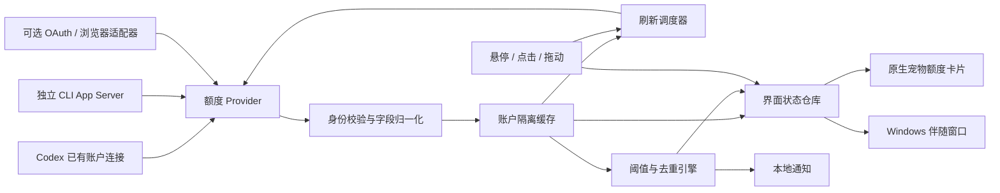

**Codex 宠物额度显示与低额度提醒：详细实现方案**

调研日期：2026-09-22。目标环境：Windows 桌面版 Codex。需求已更新为只显示周额度、只对周额度提醒，不显示五小时额度。本文只描述设计、开发步骤和验收标准，不包含功能实现。刷新周期、交互时延和性能指标均为建议设计值，需要原型验证。

**1．可行性结论与建议路线**

可以实现“鼠标悬停、点击或拖动宠物时只查看周剩余额度，以及周额度低于 20% 时提醒”。额度获取和提示逻辑都不需要调用模型生成接口，因而可以做到功能运行期间不产生模型推理 Token 消耗。

需要区分两件事：额度数据已经有可用读取通路；向现有 Codex 宠物增加界面与事件处理，则需要桌面程序层面的接入。仅修改宠物图片、`pet.json` 或编写一个 Skill，不能完成这项功能。

| 路线 | 能实现什么 | 必要前提 | 判断 |
| --- | --- | --- | --- |
| A：原生桌面端集成 | 在原宠物上准确处理悬停、点击、拖动；显示额度卡片与告警 | 可维护的桌面端源码、官方功能支持或正式扩展接口 | 完整实现的首选设计 |
| B：外置伴随窗口 | 在原宠物旁显示额度；在能定位宠物时跟随移动，保留原有点击 | Windows 能稳定识别宠物窗口及宠物实际区域 | 适合个人工具，但必须先通过定位原型验证 |
| C：独立额度宠物 | 自己渲染宠物，完全控制所有交互 | 开发独立桌面应用并使用获准使用的宠物素材 | 功能可控，但它是新宠物，不等同于增强原宠物 |
| D：修改本机已打包客户端 | 在特定版本中尝试实现 A 的效果 | 允许的开发副本、包完整性机制兼容、版本维护与回滚能力 | 实验路线；不能当作稳定插件安装方案 |

建议共用一套“额度数据层、缓存和告警引擎”，将原生显示和伴随窗口做成不同的界面适配器。如果要求必须是原来的宠物、事件必须准确，就选择 A，并把桌面端接入能力作为开工条件。若只使用当前已安装的 Windows 客户端且不修改安装包，则先验证 B；验证失败时明确说明限制，不把 C 冒充为 B。

目前没有在本次查阅的公开资料或本机宠物清单格式中发现可供第三方注册 `onHover`、`onClick`、额度组件的宠物插件接口。这个判断是本次调研边界，不代表未来版本永远不会提供此能力。

**2．调研证据：哪些已经确认，哪些仍需验证**

CodexBar 的 Codex 数据源包括 OAuth 额度接口、CLI App Server 和网页仪表盘。当前文档中，桌面应用优先使用 OAuth，CLI RPC 作为后备；网页扩展数据为可选功能，CLI 自身的自动选择顺序又有所不同。因此应借鉴其分层和认证复用方式，而不是把它简化成“读取 Cookie 就能拿到全部额度”。[CodexBar 的 Codex 数据源说明](https://github.com/steipete/CodexBar/blob/main/docs/codex.md)

OpenAI 官方文档公开了 `account/rateLimits/read` 和 `account/rateLimits/updated`，并定义了额度窗口、已用百分比、重置时间以及多额度池返回形式。这为不启动模型任务的额度查询提供了接口依据。[官方 App Server 文档](https://learn.chatgpt.com/docs/app-server)

本机只读检查发现，已安装包版本路径为 `OpenAI.Codex_26.915.4065.0_x64__2p2nqsd0c76g0`。以下是打包资源中的观察结果，不是公开扩展 API：

| 观察位置 | 已确认内容 | 对方案的意义 |
| --- | --- | --- |
| `webview/assets/avatar-overlay-native-page-4d8af7573d89.js` | 宠物区域有 pointer enter/leave、down/move/up/cancel 处理，以及拖动消息 | 原生接入有明确的事件处理位置 |
| 同一文件 | 存在 `avatar-overlay-drag-start/move/end`，并区分移动与点击 | 应复用现有交互判定，避免拖动松手后误触点击 |
| 同一文件 | 存在 `data-avatar-overlay-hit-region`，值包括 `mascot` | 宠物实际交互区域与整个透明窗口应分开处理 |
| `.vite/build/src-C3YaUE83.js` | 宠物清单识别名称、描述、精灵版本和图片路径 | 自定义宠物素材不等于可执行插件 |
| `.vite/build/main-LM8MUIFp.js` | 存在额度查询路由和鼠标穿透处理 | 桌面端已有相关基础设施，但需要受控集成 |
| `webview/assets/app-initial-6c4523b43a11.js` | 存在 `account/rateLimits/read` 调用 | 原生版优先复用应用已有账户与请求通路 |

Codex 的宠物工作流会将宠物打包成清单加精灵图。当前本地格式支持 v1/v2，不应把网页上传宠物的尺寸约束混同于本地 v2 格式；本功能本身不需要重新生成宠物素材。

还没有进行的验证包括：真实额度请求、登录态是否可被独立 CLI 复用、Windows UI Automation 能否暴露宠物独立矩形、透明窗口跟随效果、安装包是否允许开发副本改动。本次没有读取用户凭证、浏览器 Cookie 或聊天内容，也没有修改 Codex 客户端。

**3．用户体验与功能范围**

只展示当前明确选定账户/工作空间的 Codex 核心周额度，包括剩余百分比、周额度重置时间和更新时间。五小时额度不出现在悬停卡片、点击展开、拖动简条或通知中，也不参与告警。周窗口依据服务返回的时长或明确的版本语义识别，不能仅凭 `primary`/`secondary` 的位置猜测。

建议交互如下：

| 场景 | 显示行为 | 数据行为 |
| --- | --- | --- |
| 指针进入宠物区域 | 停留 250ms 后显示简洁卡片 | 立即使用缓存，必要时异步刷新 |
| 指针快速扫过 | 不弹卡片 | 不产生额外查询 |
| 点击宠物 | 显示或保持额度卡片；兼容原有点击动作 | 与悬停共享刷新节流 |
| 开始拖动 | 显示缩略额度条 | 使用缓存，不按移动帧查询 |
| 正在拖动 | 额度条随宠物移动，不遮住抓取点 | 只更新坐标 |
| 松开拖动 | 保留额度条约 1.5 秒；仍悬停则保持 | 数据过旧时可合并触发一次刷新 |
| 指针从宠物进入额度卡片 | 保持卡片 | 不重新打开或抖动 |
| 离开宠物及卡片 | 约 250ms 后关闭非固定卡片 | 不额外查询 |
| 点击固定按钮 | 固定额度卡片，再次点击取消 | 可见状态下低频刷新 |
| 周额度低于 20% | 小警示标记＋一次非模态气泡；系统通知可配置 | 仅由有效的新周额度数据触发 |

原生宠物已有点击、拖动和快捷操作，官方文档也描述了这些操作。默认保留现有点击行为，让额度卡片作为附加显示；如果要将单击改为“固定额度”，应提供明确设置项，并保留原功能入口。[官方宠物交互说明](https://learn.chatgpt.com/docs/pets)

推荐卡片信息层级：

```text
Codex 额度                         固定  刷新
个人账户 · 当前工作空间

每周剩余        ██░░░░░░░░  18%  ⚠
                9 月 25 日 14:00 重置

周额度低于 20%
15 秒前更新 · CLI 额度接口
```

以上数字仅为示例。界面必须写“周额度剩余”，不能把 `usedPercent` 原样当剩余显示。账户默认脱敏；不把短周期或模型专用额度混入周额度。“18%”无法被可靠换算成剩余消息数、请求数或 Token 数。拖动简条只显示“周剩余 18%”。

宠物尺寸、动画和任务状态继续由宠物系统管理。低额度用独立角标和气泡表达，避免直接把宠物改成 `failed`，否则用户会误以为任务执行失败。支持减少动画、键盘关闭卡片、屏幕阅读器标签与高对比度，不能只靠颜色传递低额度。

**4．整体架构与模块职责**



| 模块 | 输入与输出 | 责任边界 |
| --- | --- | --- |
| `AccountContextResolver` | 目标 host、账户、工作空间、凭证来源 → 稳定作用域 | 确认“读的是谁的额度” |
| `QuotaProvider` | 作用域 → 原始快照/错误 | 封装 App Server、OAuth、浏览器差异 |
| `QuotaNormalizer` | 原始快照 → 统一额度窗口 | 单位、空值、多额度池与数值校验 |
| `QuotaRepository` | 统一快照 → 内存缓存及必要持久化 | 账户隔离、原子提交、数据时效 |
| `RefreshCoordinator` | 定时器/交互/账户变化 → 合并请求 | 去重、超时、退避、取消旧请求 |
| `AlertEngine` | 有效额度变化 → 告警事件 | 20% 阈值、周期识别、重复抑制 |
| `PetInteractionAdapter` | 宠物事件 → 展示意图与锚点 | 原生事件与伴随观察分别实现 |
| `QuotaPopover` | 脱敏快照 → 卡片和拖动简条 | 不接触凭证，不直接发请求 |
| `NotificationAdapter` | 告警事件 → 气泡/系统通知 | 本地提醒、免打扰和点击行为 |

原生路线优先使用已有桌面技术栈和账户连接。独立 Windows 路线建议使用 C#/.NET 的 Win32/UIA 适配层加轻量桌面 UI；若团队擅长 Electron，也可以用 Electron 展示卡片并搭配小型 Windows helper。不要为了一个额度卡片移植整个 CodexBar。

CodexBar 的当前安装文档提供 macOS/Linux 发行路径，没有给出可直接用于本任务的官方 Windows 安装方案。Windows 版应复用其协议思路和必要的解析逻辑，而不是默认其 Swift/WebKit 实现可以直接运行。[CodexBar 安装说明](https://github.com/steipete/CodexBar#install)

**5．额度获取：官方 App Server 为主**

本方案推荐顺序为：原生应用已有的账户请求连接 → 独立 CLI App Server → 用户启用的 OAuth 直读 → 用户启用的浏览器数据源。跨来源切换必须保证账户和工作空间一致；认证失败不能自动借用浏览器里另一个账号。

原生模式不再启动第二个 CLI 服务，由应用现有连接读数据。独立模式启动自己拥有的隐藏子进程，通过 stdin/stdout 交换 JSONL，避免暴露网络监听端口。启动参数以安装版本支持范围为准，可参考 CodexBar 的 `codex -s read-only -a never app-server`；这些标志不是 RPC 方法白名单，监控器仍须限制自己实际发送的方法。

概念通信顺序如下，具体字段以选定 CLI 版本的 schema 为准：

```json
{"id":1,"method":"initialize","params":{"clientInfo":{"name":"codex-pet-quota","version":"0.1.0"}}}
{"method":"initialized","params":{}}
{"id":2,"method":"account/read","params":{"refreshToken":false}}
{"id":3,"method":"account/rateLimits/read"}
```

发送第一条后等待成功响应，再发送初始化通知和后续请求。协议使用唯一请求 ID、按行解码、并发响应匹配；stdout 只用于协议，stderr 单独处理。设置单条消息大小上限和解析错误处理。官方文档要求先 `initialize`，随后发 `initialized`，并支持按 CLI 版本生成类型/schema。[App Server 初始化与协议](https://learn.chatgpt.com/docs/app-server#initialization)

只需要账户和额度读取，不调用 `thread/start`、`turn/start`、`codex exec` 或模型响应接口。`account/read` 中的 `refreshToken` 参数也不应被理解为额度刷新按钮；认证更新交给 CLI 的认证流程管理。

关于 Token 消耗：按此方案由本地程序直接调用 `account/rateLimits/read`，不会产生模型推理 Token。官方文档将该方法定义为读取账户额度，将 `turn/start` 定义为开始 Codex 生成；本方案只使用前者。这个结论来自两类接口的行为区别，不是把所有 App Server 调用都视为不耗 Token。额度查询仍是网络请求，可能受接口限流；无需每次唤醒智能体来执行查询。[官方账户读取与生成方法说明](https://learn.chatgpt.com/docs/app-server)

接口可能一次返回多个窗口，本地适配器只选取周窗口。丢弃五小时数据不会增加模型调用，也不需要再请求一次才能过滤。

对独立服务的生命周期：每个明确选择的 Codex home 最多一个查询服务；冷启动建议 15 秒超时，普通请求 8 秒超时。超时后释放 pending 请求，关闭并重建自己启动的子进程；Windows 可使用 Job Object 管理其退出，不能结束用户正在工作的 Codex 进程。第一次启动只做功能探测，不进行任何模型任务。

`account/rateLimits/updated` 可用于减少显示延迟，但独立监控进程不能假设它会收到另一台设备或另一 Codex 实例的全部用量变化。必须保留主动低频刷新，不能把通知当作全账户实时推送服务。

认证方式方面，CLI 凭证可能在 `CODEX_HOME/auth.json`，也可能在系统凭证库，甚至只存在于当前进程。优先让 CLI 处理认证，比假设文件必定存在更稳妥。如果独立 CLI 无法复用桌面端登录，显示“额度来源尚未连接”，明确让用户选择匹配的 CLI 登录；不声称它自动等同于当前桌面账户。[官方认证与凭证存储](https://learn.chatgpt.com/docs/auth#credential-storage)

**6．OAuth 与 Cookie 复用的可选设计**

OAuth 直读用于需要更轻量 HTTP 查询、且已有可用本地 OAuth 凭证的场景。CodexBar 的实现读取本地凭证，向 `https://chatgpt.com/backend-api/wham/usage` 发 GET，并使用 Bearer token 和适用时的 `ChatGPT-Account-Id`。该地址属于网页后端实现，不能当作有长期兼容承诺的公开额度 API。[OAuth 请求实现](https://github.com/steipete/CodexBar/blob/main/Sources/CodexBarCore/Providers/Codex/CodexOAuth/CodexOAuthUsageFetcher.swift)

设计要求：只在本地后端内存使用访问令牌；不传给渲染页面；不写入配置、诊断导出和日志；不把 ID token 或 refresh token 当作 access token。显式尊重 `CODEX_HOME`；API-key 登录不套用 ChatGPT 套餐百分比。收到 401 后先停止该路径，让原 CLI/应用处理重新认证，随后仅重试一次，不自己竞争刷新令牌或改写共享凭证文件。

HTTP 请求限制目标域名，处理重定向时禁止把认证头带到其他来源。保留正常 TLS 验证和企业代理配置；服务不可用时进入错误/缓存状态。不要为了取额度扫描磁盘上的其他应用凭证。

Cookie 路线保留为未来扩展，当前只显示周额度的版本默认关闭；App Server 已能返回周额度时不再启动网页抓取。若未来确有需要，可以有两种受控选择：

| 方式 | 行为 | 局限 |
| --- | --- | --- |
| 用户启用的浏览器扩展桥接 | 在用户已登录的官方页面内读取必要额度数据，仅把归一化结果送给本地 helper | 需要扩展安装、页面权限与版本维护；后台刷新能力需实测 |
| 应用自己的 WebView 登录 | 用户在官方登录页面登录；会话保留在该应用自己的浏览器存储中 | 这是单独登录，不能称为直接复用用户现有浏览器 Cookie |

Windows Chrome 已引入 App-Bound Encryption，因此“直接复制 Cookie 数据库，再用普通用户进程解密”不能作为通用可靠方案。无需绕过该机制：优先 CLI，网页补充信息必要时在浏览器本身的会话中读取。[Chrome 官方安全说明](https://security.googleblog.com/2024/07/improving-security-of-chrome-cookies-on.html)

扩展桥接应尽量让 Cookie 留在浏览器内，使用受限 native messaging 通道传递额度结果；只允许受信任的扩展 ID 和限定消息 schema。遇到登录页、权限提示或反自动化页面，返回“需用户处理”，不把这些页面误解析成 0%。网页与 CLI 必须核对账户和工作空间，邮箱相同也不代表工作空间相同。

**7．统一数据结构、账户隔离和数值语义**

建议的领域模型如下，是本功能自己的模型，不是声称服务端会原样返回这些字段：

```text
QuotaSnapshot
  schemaVersion
  scopeKey                 // 本地生成的 host + source + account + workspace 作用域
  identityConfidence       // verified | selected-source-only | unverified
  generation               // 账户/来源每次切换递增
  source                   // native-rpc | cli-rpc | oauth | browser
  fetchedAt                // 成功接收时间
  lastAttemptAt
  state                    // ready | partial | stale | offline | auth-required | unsupported | error
  buckets[]
    limitId
    displayName
    windows[]
      role                 // primary | secondary | additional
      windowDurationMins   // number | null
      usedPercent          // number | null
      remainingPercent     // number | null
      resetsAt             // UTC Unix 秒 | null
      validity             // known | unknown | invalid
  credits                  // 独立可选字段，不混入百分比
  lastGoodSnapshot         // 同一作用域的历史数据；有明确时间
```

上述为可兼容不同来源的中间模型。实际传给宠物 UI 和告警引擎的是 `WeeklyQuotaView`：只包含作用域、周剩余百分比、周重置时间、更新时间和有效性状态。其他窗口不进入当前功能的展示、提醒或持久化需求。

归一化规则：

1. 对有限且位于合理范围的 `usedPercent` 计算 `remainingPercent = clamp(100 - usedPercent, 0, 100)`；缺失、null、非数值或明显异常值按未知/异常处理，不能直接变成 100%。
2. 优先使用 `rateLimitsByLimitId`，兼容只有 `rateLimits` 的旧格式。只从选定的 Codex 核心额度池提取周窗口，不对其他窗口或模型专用额度取最小值。
3. 优先按 `windowDurationMins = 10080`（7 天）识别周窗口；OAuth 秒制窗口先转换单位。只有已验证的协议版本明确标识为周额度时，才允许语义映射。不能无条件把 `secondary` 当成周额度；若缺少时长且无法确认其语义，显示“周额度暂不可用”。
4. `resetsAt` 是 Unix 秒。内部统一 UTC，展示转换为用户时区，同时提供相对倒计时和绝对重置时间。
5. 到了本地推算的重置时刻，只触发刷新并显示“等待确认重置”，不能自己把剩余改成 100%。
6. 周窗口有效即可正常显示，其他窗口缺失不影响本功能。只有五小时数据而缺少周数据时，显示“周额度暂不可用”，不使用五小时数据替代，也不触发低额度提醒。
7. 本版本不展示额外购买额度、工作空间资金池或可用重置次数；不能把这些数据加到周百分比，也不能由周额度 0% 推断所有付费后备额度必然耗尽。
8. 本地日志统计最多作为“本机历史用量”信息，不作为真实剩余额度来源；它无法覆盖其他机器的消费或服务端规则变化。

多额度池字段及时间语义依据官方 schema；OAuth 秒制字段可对照 CodexBar 解析实现。[官方额度字段](https://learn.chatgpt.com/docs/app-server)、[CodexBar OAuth 字段映射](https://github.com/steipete/CodexBar/blob/main/Sources/CodexBarCore/Providers/Codex/CodexOAuth/CodexOAuthUsageFetcher.swift)

身份隔离是正确性的前提。原生模式使用应用已确认的 host/account/workspace 上下文。独立模式如果只能确认“某 CLI 配置下的账号”，卡片必须标明“CLI 账户”，不能未经核验声称它就是当前宠物所属账户。

缓存以来源、host、账户和工作空间分区。账户 ID 可在本地用带本机随机盐的摘要生成缓存键；不要用原始令牌作 key。身份无法确认时，禁止跨来源补全，不展示上一账户缓存。任何在账户切换前发起的响应，即使更晚返回，也必须因 `generation` 不匹配而被丢弃。

**8．刷新、缓存和错误处理**

建议先采用容易解释的固定策略，之后再依据测量调整：

| 条件 | 建议策略 |
| --- | --- |
| 启动且已配置监控 | 发起一次读取 |
| 宠物显示、用户正在使用桌面 | 每 60 秒刷新一次，可加少量随机抖动 |
| 固定卡片打开 | 每 30 秒一次 |
| 宠物隐藏、后台监控仍开启 | 每 5 分钟一次 |
| 整个功能已关闭 | 终止查询和监控 |
| 新悬停/点击 | 缓存超过 30 秒才安排一次刷新；同一账户合并请求 |
| 手动刷新 | 与在途请求合并，最短间隔 10 秒 |
| 系统睡眠、锁屏 | 暂停常规查询；恢复后合并刷新一次 |
| 即将重置 | 重置后约 2～5 秒验证一次；失败按退避规则处理 |

上述频率是产品设计默认值，不是服务器许可的固定速率。遇到 429，以 `Retry-After` 为优先；没有提示则采用约 30 秒、60 秒、120 秒直至 15 分钟的指数退避和抖动。401 转为需要认证，403 标记权限/来源不可用，避免无休止切换接口。

每个作用域只保留一个正在进行的读取任务。悬停、点击、拖动完成、定时器同时触发时共享其结果；拖动的 60 帧坐标更新不得变成 60 次查询。后到的旧请求不得覆盖较新快照。

成功读取不超过 2 分钟标记为新鲜，2～10 分钟为历史快照，超过 10 分钟在主卡片显示“当前额度未知”，可折叠展示上次读数。离线、认证失效或范围不完整必须同时体现在数据状态中，而不是仅靠时间判断。

只有刚成功验证的、身份匹配的数据可以触发新的额度告警。离线时保留历史告警标记但标明时间；不反复发送系统通知。进程重启后，磁盘缓存可用于占位，但必须经过当前身份确认和在线读取才能新发告警。

额度状态是账户层面的近实时快照。其他设备同时使用、接口更新延迟和轮询间隔都可能造成短暂滞后，界面因此必须显示更新时间。

**9．20% 告警的明确规则**

默认阈值严格按“低于 20%”实现，即 `remainingPercent < 20`。恰好 20% 不触发。如果用户选择“低于或等于”，这是独立设置，不改变默认语义。判断使用原始有效数值；接近边界时展示一位小数，避免 19.6% 被四舍五入成 20% 却出现告警。

只判断选定核心额度池的周窗口。周额度 19% 时提醒；即使五小时额度已降到 0%，只要周额度仍为 80%，本功能也不产生低额度提醒。额外模型专用额度不展示、不参与告警。

| 状态/事件 | 应有行为 |
| --- | --- |
| 首次有效读取就低于 20% | 本周期尚未提醒则提醒一次，不要求先看到高于 20% |
| 23% 降到 19% | 触发提醒并记录本周期已提醒 |
| 19% → 18% → 17% | 更新数字和角标，不重复弹通知 |
| 19% → 21% → 19% | 不重复通知；用滞回防止角标抖动 |
| 五小时和周窗口都低于 20% | 只发周额度提醒，通知中不列五小时数据 |
| 五小时低于 20%，周额度正常 | 不触发本功能的低额度提醒 |
| 开启可选严重阈值且跌到 5% 以下 | 允许每周期另提醒一次；默认可关闭 |
| 周窗口为 0% | 显示“周额度已用尽”，与未知值区分 |
| 明确进入新周期 | 新周期重新获得一次低额度提醒机会 |
| 账户/工作空间切换 | 用对应作用域的提醒记录，不沿用其他账户状态 |
| 用户选“本周期不再提醒” | 抑制该周期弹窗，卡片仍显示额度 |
| 数据失效、断网或身份未知 | 不新增额度不足通知 |

建议去重标识是 `(scopeKey, limitId, windowIdentity, confirmedCycleId, thresholdLevel)`。不要直接把未经确认的 `resetsAt` 每次变化都当成新周期：服务器重置时间可能修正，从而制造重复提醒。

周期识别策略：初次成功读取建立周期；旧窗口到期后，后续有效响应显示下一重置时间并满足窗口边界条件，才确认新周期。对大幅用量回落、异常重置时间变动，安排一次间隔至少 10 秒的确认读取；无法确认时沿用既有去重周期并标记重置待确认。不要用本地钟表单独触发“额度恢复”。

角标采用滞回：低于 20% 时出现，至少两次有效读取均达到 25% 后清除；已经确认的新周期正常快照可以直接清除。角标清除不抹掉同周期已通知记录，因此再次跌破不会刷屏。去重状态持久化，重启软件不会重发同一条提醒。

默认气泡持续约 8 秒，不抢键盘焦点，不发声音。系统通知尊重免打扰；如果系统通知不可用，宠物角标和卡片仍要工作。用户点击系统通知时打开额度卡片，不自动发消息、不开始任务。

示例文案：“Codex 周额度剩余 18%，低于设定的 20%。预计 9 月 25 日 14:00 重置。”

**10．路线 A：原生宠物集成设计**

这条路线能完整满足“就在原宠物上交互”的要求。前提是有可维护的桌面端接入方式；官方开源 CLI/App Server 仓库的存在，不代表已安装桌面 UI 的源码及发布权限也可获得。

开发时新增 `PetQuotaController`，从桌面账户层获取已归一化额度，并订阅账户切换。宠物渲染层只读取脱敏状态。尽可能复用设置页或主界面的额度缓存，避免同一应用多个窗口重复刷新。

事件接入位置以“宠物 hit region”和现有拖动状态机为准，不绑定整个透明浮窗。悬停处理增加延时显示/隐藏；pointer down 标记按下，现有逻辑认定开始移动后进入拖动简条；pointer up 依据现有 `hasMoved` 区分点击与松手。`pointercancel`、失去捕获、窗口销毁必须清理计时器和状态。

当前包能观察到约 4 个 screen 坐标单位的移动判断，但这是版本实现细节。原生方案应复用已有判定结果，不能在新模块里重新写死一个不同阈值。只消费业务意义上的 `dragStart/dragEnd/click`，可减少升级时耦合。

建议状态转换：

```text
hidden → hoverPending → hoverVisible
hoverVisible → pressed → dragging → hoverVisible / hidden
hoverVisible ↔ pinned
任意状态 + quotaLow → 更新独立告警标记
pointerCancel / petHidden / scopeChanged → 清理瞬态并重新校验
```

额度卡片作为宠物布局树中的受控浮层，或由原生窗口管理器创建配套小窗口。需把卡片矩形纳入窗口尺寸和命中区域计算，否则 HTML 内容即使溢出容器，也可能被宿主窗口裁剪。展示前检测屏幕工作区，优先在宠物上方，空间不够时翻到下方或侧边。

鼠标穿透要按区域管理：透明空白可穿透，宠物继续接收原事件，额度卡片的按钮可交互，拖动简条自身不截获宠物拖动。Electron 提供忽略鼠标事件及移动事件转发机制，但应接入应用已有实现，不让两套逻辑相互覆盖。[Electron 窗口交互文档](https://www.electronjs.org/docs/latest/tutorial/custom-window-interactions)

增加 feature flag、阈值与显示设置；禁用时卸载订阅、隐藏卡片、结束本功能自己的计时器。新增代码全部围绕数据与界面适配器组织，不让额度逻辑进入精灵帧计算。

**11．路线 B：Windows 外置伴随窗口设计**

路线 B 不修改已安装客户端。它在原宠物旁创建独立小窗口，因此实现难点是定位和交互观察，而不是额度接口。

第一道验证关卡必须确认：能否在标准用户权限下，从目标 Codex/ChatGPT 进程的窗口和可访问性元素中，取得稳定的宠物矩形、显示状态和所在显示器。内部 DOM 的 `data-avatar-overlay-hit-region` 不会自动变成外部可读的 UI Automation 属性，因此不能仅凭本次源码观察就宣布定位已解决。

建议定位优先级：正式外部几何接口（如果未来出现）→ UI Automation 的明确宠物元素 → 经版本验证的专用宠物窗口几何适配。只凭窗口标题或整块透明窗口矩形，容易把输入栏、任务通知和透明边缘误认为宠物，不满足准确交互要求。

定位成功后，用限定目标进程的 `SetWinEventHook` 观察显示、隐藏、销毁和位置变化；UIA 可用时监听 BoundingRectangle 变化。采用进程外事件模式，并有消息循环、事件去重和及时取消订阅。此接口能报告窗口/可访问性事件，不会自动提供 React 的 hover/click 事件。[Microsoft SetWinEventHook 文档](https://learn.microsoft.com/en-us/windows/win32/api/winuser/nf-winuser-setwineventhook)

悬停可通过系统指针位置、宠物可见矩形以及遮挡判断进行观察，宠物附近约 20Hz 检查即可，离开后降频。点击/拖动若没有可访问性事件，则需要范围受限的原生鼠标事件观察，并验证按下/松开与窗口移动的关系；观察器不拦截、不重放事件，也不记录其他应用点击。不能仅通过低频采样左右键状态承诺检测所有快速点击。

伴随卡片位于宠物旁边，默认不激活主窗口，也不盖住原宠物。点击宠物仍由原客户端处理；伴随软件只附加显示，不能在此路线下承诺改写原宠物的单击含义。卡片固定按钮只接收自己窗口内的输入。

跟随时保存的是“宠物屏幕锚点＋相对偏移”，而不是屏幕绝对坐标。拖动期间通过位置事件更新，必要时短时补充 30～60Hz 几何采样；平时停止高频循环。每次显示器变化重新进行物理像素和 DPI 坐标转换，处理 125%/150%/200% 缩放、负坐标显示器和任务栏工作区。

宠物隐藏、进程退出、切换虚拟桌面或识别失效时，隐藏伴随卡片。重新识别后才恢复。不得在旧位置留下可点击的“幽灵窗口”。如果只识别到窗口外框而识别不到宠物，显示明确兼容性状态；可以保留托盘额度，但不能验收为“宠物悬停完成”。

定位原型失败时的产品决策必须显式记录：等待原生集成，或由用户另行选择独立宠物方案。图像识别可以作为实验研究项，但不作为默认依赖，因为皮肤、缩放、动画和遮挡都会影响定位。

**12．路线 D：本机打包资源改动的维护边界**

本机静态检查证明存在相关渲染和事件代码，但不能据此保证可以安全修改当前安装包。若未来专门选择这条实验路线，应先在可运行的开发副本上验证包完整性、资源校验和启动链是否支持改动。遇到签名/完整性限制，应转回可维护的开发方式，不把关闭系统保护作为方案前提。

需要记录客户端版本、原始文件哈希、补丁适用条件和回滚步骤；先验证结构标记唯一匹配，再修改，不依赖混淆后的函数短名或固定字节偏移。安装包升级后默认停止应用旧补丁，重新跑交互与数据测试。

此路线至少涉及额度状态注入、宠物事件接入、布局/命中区域更新三部分，不是往 `pet.json` 添加一个字段。它的升级维护成本明显高于普通素材包，也不能通过给开源 CLI 提一个 PR 就完成桌面功能交付。

**13．运行边界、配置和可诊断性**

“不消耗 Token”指没有模型推理调用；OAuth 的 access token 是认证凭证，和计费 Token 是两个概念。额度查询仍会访问网络，也可能遇到限流。鼠标事件、倒计时、阈值判断、动画和通知均在本地完成。

| 操作 | 是否产生模型推理 Token |
| --- | --- |
| 启动本地 App Server 并完成初始化 | 不产生；没有启动模型生成 |
| 直接调用 `account/read`、`account/rateLimits/read` | 不产生；属于账户信息查询 |
| 本地过滤周窗口、渲染卡片、判断 20% 和发送本地通知 | 不产生 |
| 让智能体定期接收“帮我查询额度”的提示并回复 | 外层模型对话会消耗，因此本方案不采用 |
| 通过 App Server 的 `turn/start` 发起正常任务 | 会启动模型生成；不在额度监控流程内 |

本功能使用普通本地进程与定时器，不使用需要唤醒模型的任务自动化。读取工具本身不生成模型输出，但如果每分钟让智能体执行一次“帮我查额度”，外层模型运行仍可能消耗额度，因此不采用这种运行方式。

建议配置：

```json
{
  "enabled": true,
  "displayMode": "native-or-companion",
  "sourceMode": "app-server",
  "quotaScope": "codex-weekly-only",
  "warningRemainingPercent": 20,
  "warningComparison": "lt",
  "criticalAlertEnabled": false,
  "criticalRemainingPercent": 5,
  "hoverDelayMs": 250,
  "hideDelayMs": 250,
  "dragReleaseDisplayMs": 1500,
  "visibleRefreshSeconds": 60,
  "pinnedRefreshSeconds": 30,
  "hiddenRefreshSeconds": 300,
  "systemNotificationEnabled": true,
  "browserExtrasEnabled": false,
  "showAccountDetails": false
}
```

配置只放行为和非敏感引用，不放 token、Cookie 或原始认证文件副本。缓存和告警记录保存在本功能自己的用户目录，只保存必要额度、时间和脱敏作用域。退出登录或删除来源时清理对应缓存。主进程/辅助进程到 UI 的通信使用 schema 校验，UI 不能指定任意 URL、命令或文件路径。

诊断信息包含：客户端/CLI 版本、数据源、身份核验状态、上次成功时间、耗时、错误类型、缓存是否过期、定位质量和脱敏作用域。不要记录完整 HTTP 请求头、原始认证响应、Cookie 或聊天内容。网页扩展模式增加“桥接已连接/需登录/页面不兼容”等具体状态。

若复用 CodexBar 的代码，固定具体 commit 或发行版本，并依据其 MIT 许可证保留相应版权与许可文本。只参考设计而自行实现协议适配，仍应在文档中标明来源。[CodexBar LICENSE](https://github.com/steipete/CodexBar/blob/main/LICENSE)

**14．开发顺序、交付物与工期估算**

以下是单名熟悉 Windows 桌面和 TypeScript/C# 开发者的粗略估算，不包括取得桌面源码/官方接口的等待时间；实际工期由第一阶段决定。

| 阶段 | 工作 | 可审核交付物 | 预计 |
| --- | --- | --- | --- |
| P0：可行性原型 | 验证只读额度查询、目标账户对应关系、原生接入条件或外部定位能力 | 能力矩阵、脱敏样本、路线选择记录 | 1～2 天 |
| P1：额度核心 | Provider、归一化、缓存、账户隔离、刷新退避 | 数据层及错误状态演示 | 2～3 天 |
| P2：交互界面 | 悬停卡片、点击附加显示、拖动简条、多屏定位 | 实际宠物交互演示 | 原生 2～4 天；伴随 3～6 天 |
| P3：提醒 | 20% 规则、周期去重、角标、系统通知、设置 | 边界案例与提醒录像 | 1～2 天 |
| P4：可靠性 | 长时间运行、升级、断网、睡眠唤醒、打包和回滚 | 验收报告、发布包、使用说明 | 2～3 天 |

原生路线在具备可维护接入条件后约 8～14 个工作日；伴随路线在定位通过后约 9～16 个工作日。Cookie 扩展桥接作为独立可选阶段，额外约 3～5 个工作日，不作为基础版本发布前提。安装包补丁路线的版本适配成本不计入上述估算。

P0 的通过标准必须同时满足：额度来源和账户可核验；查询链路不发送模型请求；选定显示路线能准确覆盖要求的交互。只成功读到数字，不能据此宣布整个项目可交付。

建议后续项目结构：

```text
codex-pet-quota/
  core/          领域模型、归一化、缓存、调度、告警
  providers/     native-rpc、cli-rpc、可选 oauth、browser
  integration/   native-pet、windows-companion
  ui/            卡片、拖动简条、设置
  platform/      Windows 窗口事件、DPI、通知、进程管理
  fixtures/      脱敏或合成的额度响应与异常样本
  docs/          使用方式、兼容版本、诊断、回滚
```

最终交付包括来源可追踪的代码、配置说明、脱敏测试夹具、兼容矩阵、验收结果与卸载说明。卸载伴随程序应移除自己的自启动、窗口监听和缓存，不改变 Codex 的登录状态或宠物素材。

**15．验收测试与完成定义**

| 测试场景 | 验收标准 |
| --- | --- |
| 基础计算 | `usedPercent=82` 显示剩余 18%；0 已用显示 100%；100 已用显示 0% |
| 空值/异常 | null、缺失、NaN、异常负数不显示成 100%，不触发额度不足 |
| 仅周显示 | 悬停、点击、拖动及通知只出现周额度，不出现五小时额度 |
| 仅周提醒 | 五小时 0%、周 80% 时不提醒；五小时 80%、周 19% 时只提醒周额度 |
| 周窗口缺失 | 即使五小时数据可用，也显示“周额度暂不可用”，不替代或误报 |
| 多额度池 | 仅某模型专用池低时，不误报核心 Codex 周额度不足 |
| 严格边界 | 剩余 20% 不触发，19.9% 触发；显示精度与提示一致 |
| 首次低额度 | 首次有效读取 15% 时提醒一次 |
| 重复抑制 | 连续轮询、重复悬停、重启进程不会重复提醒同一周期 |
| 重置时间修正 | 小幅改变 `resetsAt` 不视为新周期、不再次弹窗 |
| 真正重置 | 新周期经接口确认后更新显示，并重新允许本周期提醒 |
| 身份切换 | A 的慢请求在切到 B 后返回，不能写入 B 的显示或缓存 |
| 独立 CLI 身份 | 无法核验与桌面账号一致时，清楚显示 CLI 来源，不假装匹配 |
| 离线与登录失效 | 标注历史读数/需登录，不伪造最新数字，不告警轰炸 |
| 快速鼠标扫过 | 不闪烁卡片；持续悬停按延时显示 |
| 点击/拖动区分 | 拖动松手不触发单击动作，原宠物功能没有被阻断 |
| 高频拖动 | 几何刷新与网络查询解耦，拖动不增加每帧请求 |
| 卡片跨边界 | 从宠物移入卡片不消失，透明区不拦截其他应用点击 |
| 多显示器 | DPI 不同、负坐标、贴边拖动后卡片仍在工作区内 |
| 生命周期 | 宠物隐藏、客户端关闭、虚拟桌面切换后无幽灵窗口 |
| 来源切换 | 浏览器账号不匹配时拒绝补全；不混用不同账户数据 |
| 零模型调用 | 请求日志白名单只见认证/额度读取；不见 turn/start、Responses 等生成调用 |
| 客户端升级 | 兼容检查失败时关闭原生补丁/定位适配，给出具体状态 |

建议性能目标：缓存读取后的卡片内容绘制低于 100ms，另加 250ms 悬停防误触延时；拖动跟随视觉延迟低于 100ms；静止时本功能无持续高频渲染；查询并发每作用域最多一个。空闲 CPU 可先以测试机平均低于约 1% 为优化目标，内存应在 P0 分别测量主程序和 CLI 子进程，不能只统计 UI。

数值与异常逻辑使用合成响应测试，窗口和交互使用实际桌面验证；少量真实只读查询用于账户和接口集成验证。不要为了验证提醒而运行耗额度任务，直接注入 25%→19%→18% 等测试序列。判断是否“零模型调用”依赖发送方法与网络路径审计，不能仅凭账户百分比没变化推断。

完成功能的标准是：在明确支持的客户端版本上，鼠标悬停、点击和拖动三种场景都只显示正确账户的周额度；周额度低于 20% 时准确提醒且不重复；五小时数据不显示也不参与告警；周额度未知或过期时明确标识；运行中没有模型推理请求；关闭或卸载后不干扰原宠物与 Codex 登录。

**16．本次方案最终建议**

将额度读取作为普通本地服务，优先通过 Codex App Server 复用认证；把 Cookie 功能留给确有必要的网页补充数据。原生显示层复用已有宠物事件与命中区域，低额度以独立角标、卡片和本地通知表达。

对当前个人 Windows 环境，首先做“额度身份验证＋宠物定位”的小原型，决定采用原生接入还是伴随窗口。若必须准确改造现有宠物而又没有桌面端接入条件，应将这一点保留为明确依赖，不能承诺安装一个宠物素材包或 Skill 就能完成。
